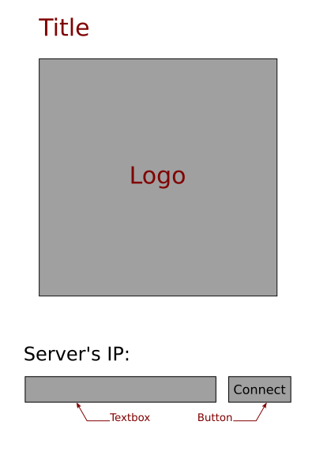
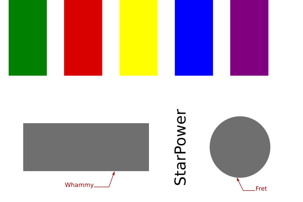

Specifications
==============

- Platform: all mobile platform (mainly Android & iOS)
- mode: client (mobile) / server (computer)
- communication: TCP (socket)
- orientation: landscape

Server
------

- HTTP interface to choose who is who (mutli-player)

Client
------

- Connection

- Play

